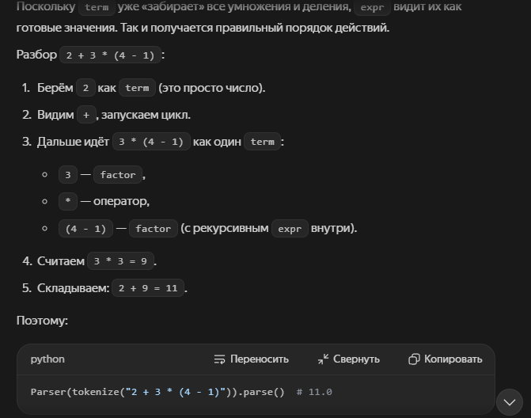

# Парсинг – практики и примеры использования

Парсинг (от англ. parse - разбор, синтактический анализ) – это процесс анализа исходного текста/данных по формальным правилам грамматики и преобрахование их в структурированное представление, удобное для дальшейшей обработки. Парсинг превращает сырой текст в данные, с которыми можно работать программно.

Пример: HTML-страница - это просто текст. Парсер разбирает  её и превращает в дерево объектов (DOM), после чего вы можете обращаться к элементам: "дай мне все ссылки", "найди заголовок h1" и т.д.

## Любой парсер работает по двухфазной (а иногда трёхфазной) системе:

1. Лекический анализ (токенизация / Tokenization). Исходный текст разбивается на минимально значимые единицы - токены.

```Python
"3 + 4 * x" -> [ЧИСЛО(3), ОПЕРАТОР(+), ЧИСЛО(4), ОПЕРАТОР(*), ИДЕНТИФИКАТОР(x)]
```

2. Синтактический анализ (Parsing). Токены объединяются согласно грамматике языка - дерево разбора (parse tree / AST)

```Python
        Выражение
       /    |     \
   Число   +    Выражение
    3           /   |   \
             Число  *  Идентификатор
               4         x
```

3. Cеманический анализ. Проверка смысла: типы, существование переменных и т.п.

## Основные стратегии разбора

| Стратегия                      | Принцип                                         | Использование                                                   |
| --------------------------------------- | ------------------------------------------------------ | ---------------------------------------------------------------------------- |
| Регулярные выражения | Сопоставление с шаблоном         | Простые, регулярные структуры (логи, даты) |
| Строковые методы         | split, find, startswith                                | Прос                                                                     |
| Библиотечные парсеры | Готовый парсер под формат        | HTML, XML, JSON                                                              |
| Рекурсивный спуск       | Ручная реализация грамматики | Небольшие DSL, калькуляторы                             |
| Генераторы парсеров   | Грамматика -> код                         | Сложные языки (PEG, LALR)                                        |

## Использование парсеров

JSON - встроенный парсер (предпочтителен ручному разбору)

```Python
import json

raw = '{"name": "Igor", "age": 30, "skills": ["Python", "Django"]}'

data = json.loads(raw) 
print(repr(data))  # {'name': 'Igor', 'age': 30, 'skills': ['Python', 'Django']}
print(type(data))  # str -> dict

# И обратно
text = json.dumps(data, ensure_ascii=False, indent=2)  # ensure_ascii отвечает за кодировку не-ascii-символов (False оставит кириллицу, True заменит на escape-последовательности)
print(repr(text))  # '{"name": "Igor", "age": 30, "skills": ["Python", "Django"]}'
print(type(text))  # dict -> str
```

2. Строковые методы – для простых форматов

```Python
import csv
from io import StringIO

raw = 'name,city\n"Ivanov, P.", "Moscow"\nPetrova,SPb'

for row in csv.DictReader(StringIO(raw)):
  print(row)  # {'name': 'Ivanov, P.', 'city': 'Moscow'}
```

3. Регулярные выражения - структурированные тексты (логи, даты)

```Python
import re

# Парсинг строки лога: 2026-09-19 12:33:01 ERROR disk full

log_pattern = re.compile(  # Компилирует регулярное выражение в объект паттерна для многократного использования для поиска/матчинга
    r"(?P<date>\d{4}-\d{2}-\d{2})\s+"
    r"(?P<time>\d{2}:\d{2}:\d{2})\s+"
    r"(?P<level>INFO|WARN|ERROR)\s+"
    r"(?P<message>.+)"
)

match = log_pattern.match("2026-09-19 12:33:01 ERROR disk full")

if match:
    print(match.group("level"))  # ERROR  (group возвращает часть строки, совпадающую с группой в регулярном выражении)
    print(match.group("message"))  # disk full  (group возвращает часть строки, совпадающую с группой в регулярном выражении)
    print(match.groupdict())  # {'date': '2026-09-19', 'time': '12:33:01', 'level': 'ERROR', 'message': 'disk full'}  (groupdict() возвращает словарь для всех именованных групп)
  
# Извлечение всех email из текста
emails = re.findall(r"[\w.+-]+@[\w-]+\.[\w.]+", "a@x.ru, b@y.org")  # поиск и возврат всех непересекающихся совпадений
print(emails)  # ['a@x.ru', 'b@y.org']
```

Правила работы с regexp:

* Компилируем шаблон (re.compile) для много кратного использования (при необходимости)
* Использовать именованные группы `(?P<name>...)` для повышения читаемости
* Не пытаться парсить regex-ом вложенные структуры (HTML, JSON)

4. HTML – BeautifulSoup (веб-парсинг)

```Python
# pip install beautifulsoup4 requests
from bs4 import BeautifulSoup
import requests

html = """
<html>
    <body>
        <h1 class="title">Title</h1>
        <ul>
            <li>Item-1</li>
            <li>Item-2</li>
        </ul>
        <a href="https://example.com/page">Link</a>
    </body>
</html>
"""

soup = BeautifulSoup(html, "html.parser")

h1 = soup.find(h1, class_="title")  # Title
items = [li.text for li in soup.find_all('li')]  # ["Item-1", "Item-2"]
link = soup.select_one("a[href]")  # https://example.com/page

# Реальный сайт
resp = requests.get("https://example.com", timeout=10)
soup = BeatifulSoup(resp.text, "lxml")
```

5. Парсинг элементов командной строки - argparse

```Python
import argparse

parser = argparse.ArgumentParser(description="Утилита копирования")
parser.add_argument("source", help="исходный файл")
parser.add_argument("-o", "--output", default="out.txt", help="куда копировать")
parser.add_argument("-v", "--verbose", action="store_true")

args = parser.parse_args()  # парсинг аргументов командной строки (sys.argv)
print(args.source, args.output, args.verbose)

# Запуск скрипта: python main.py data.csv -o result.csv -v
# Этот скрипт берёт то, что пользователь написал в терминале после python main.py и раскладывает по переменным
```

6. Парсинг Python-кода - модуль ast

```Python
import ast

code = """
def add (a, b):
	return a + b
"""

tree = ast.parse(code)  # AST Python-кода (Abstract Syntax Tree)
print(tree)  # Module(body=[FunctionDef(name='add', args=arguments(posonlyargs=[], args=[arg(...), arg(...)], vararg=None, kwonlyargs=[], kw_defaults=[], kwarg=None, defaults=[]), body=[Return(value=BinOp(...))], decorator_list=[], returns=None, type_comment=None, type_params=[])], type_ignores=[])

for node in ast.walk(tree):
  if isinstance(node, ast.FunctionDef):
    print(f"Функция: {node.name}, аргументы: "
         f"{[a.arg for a in node.args.args]}")

# Функция: add, аргументы: ['a', 'b']
```

AST (Abstract Syntax Tree) - абстрактное синтаксическое дерево - это структурированное представление Python-кода, где вместо текста (строк и символов) - объекты и связи между ними. Python сначала превращает код в AST, а потом исполняет его. Абстрактное - значит, что в дереве нет "мелочей оформления" (пробелов, табуляции, комментариев, лишних скобок), а есть только смысловые конструкции (функции, циклы, условия, операции, присваивания)

7. Собственный парсер - рекурсивный спуск (калькулятор)

```Python
import re


# --- 1. Лексер: разбиваем текст на токены ---
TOKEN_RE = re.compile(r"\s*(?:(\d+\.?\d*)|(.))")

def tokenize(text):
    tokens = []
    for num, op in TOKEN_RE.findall(text):
        if num:
            tokens.append(("NUM", float(num)))
        elif op:
            tokens.append(("OP", op))
  
    tokens.append(("END", None))
    return tokens

print(tokenize('asd1.2'))  # [('OP', 'a'), ('OP', 's'), ('OP', 'd'), ('NUM', 1.2), ('END', None)]


# --- 2. Парсер: рекурсивный спуск по грамматике ---
# Грамматика (приоритёт учтён порядком правил):
#   expr   := term (('+' | '-') term)*
#   term   := factor (('*' | '/') factor)*
#   factor := NUM | '(' expr ')'

class Parser:
    def __init__(self, tokens):
        self.tokens = tokens
        self.pos = 0
  
    def peek(self):
        return self.tokens[self.pos]
  
    def next(self):
        tok = self.tokens[self.pos]
        self.pos += 1
        return tok
  
    def parse(self):
        result = self.expr()
        if self.peek()[0] != "END":
            raise SyntaxError(f"Неожиданный токен: {self.peek()}")
        return result
  
    def expr(self):  # сложение/вычитание
        value = self.term()
        while self.peek() == ("OP", "+") or self.peek() == ("OP", "-"):
            _, op = self.next()
            right = self.term()
            value = value + right if op == "+" else value - right
        return value
  
    def term(self):  # умножение/деление
        value = self.factor()
        while self.peek() == ("OP", "*") or self.peek() == ("OP", "/"):
            _, op = self.next()
            right = self.factor()
            value = value * right if op == "*" else value / right
        return value
  
    def factor(self):  # Число или скобка
        kind, val = self.next()
        if kind == "NUM":
            return val
        if (kind, val) == ("OP", "("):
            value = self.expr()
            if self.next() != ("OP", ")"):
                raise SyntaxError("Ожидалась закрывающая скобка")
            return value
        raise SyntaxError(f"Неожиданный токен: {val}")
  
print(Parser(tokenize("2 + 3 * (4 - 1)")).parse())  # 11.0
print(Parser(tokenize("(2 + 3) * 4")).parse())  # 20.0
```

expr, term, factor - это уровни грамматики,  которые задают приоритет операций. Именно так парсер понимает, что умножение делается раньше сложения, а скобки - раньше всего. То есть, грамматика кодируется структурой методов - `expr` вызывает `term`, `term`вызывает`factor`. Так автоматически обеспечивается приоритет `*` над `+`.

* `factor` - это то, что нельзя разбить дальше без скобок `(4 - 1)`
* `term` - уровень умножения и деления: сначала берёт один factor, потом пока видит * и / берёт следующий factor и применяет операцию.
* `expr` - уровень сложения и вычитания (верхний): сначала берёт один term, потом пока видит + или - берёт следующий term, и складывает/вычитает. Поскольку term уже "забирает" все умножения и деления, expr видит их как готовые значения. Так и получается правильный порядок действий.



8. Сложные грамматики - генераторы парсеров (PEG). Для больших языков грамматика пишется декларативно:

```Python
from pyparsing import Word, nums, oneOf, Forward, Suppress, Group, OneOrMore

number = Word(nums)
operand = number

# Рекурсивное определение для скобок
expr = Forward()

# factor: число или (expr)
factor = operand | Group(Suppress("(") + expr + Suppress(")"))

# term: factor, за которым может идти много пар (*|/) factor
term = factor + OneOrMore(oneOf("* /") + factor)

# expr: term, за которым может идти много пар (+|-) term
expr <<= term + OneOrMore(oneOf("+ -") + term)

result = expr.parseString("3 + 4 * 5", parseAll=True)
print(result.asList())
# Вывод: ['3', '+', '4', '*', '5']
```

## Правила использования парсинга

1. **Не изобретать парсер, если он уже есть**. JSON -> json, CSV -> csv, XML -> lxml/ElementTree, HTML -> BeautifulSoup, даты -> dateutil, аргументы CLI -> argparse. Готовые парсеры обрабатывают краёние случаи (кавычки, экранирование, кодировки), которые можно упустить из виду.
2. **Regex - для регулярных, а не вложенных структур.** Парсить HTML регулярками - антипаттерн (вложенность `<div><div></div></div>` надёжно regexp не разобрать)
3. **Валидирование входных данных.** Нужна постоянная обработка исключений (json.JSONDecodeError, SyntaxError) и не падать на malformend-вводе.
4. **Указание кодировки** при чтении файлов: `open(f, encoding="utf-8")`
5. **Для веб-парсинга нужно соблюдать** `robots.txt`, использовать `timeout` в запросах, не создавать лишнюю нагрузку (паузы между запросами) и учитывать, что загружаемый JS контент требует headless-браузера (Playwright, Selenium)
6. **Тестируйте парсер** на реальных примерах данных, включая "грязные" - так выявляются 90% проблем заранее.

**Резюме:** парсинг = текст -> структура. Подход строится на фазах: лексер -> парсер -> семантика и выборе инструмента по сложности данных: от `split()` и regex для простого текста, до рекурсивного спуска и PEG-грамматик для полноценных языков.
